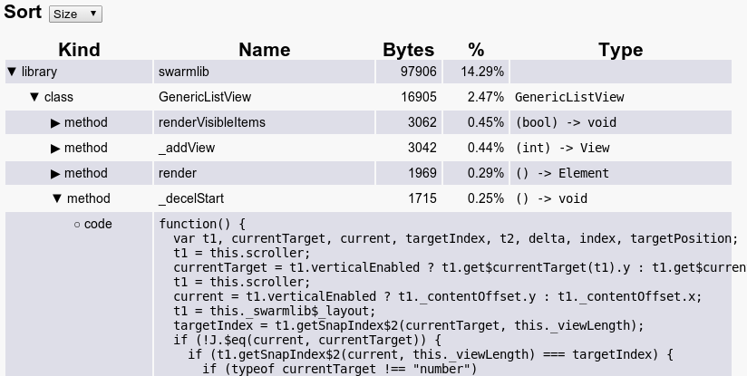

# Dump-Info visualizer

A web based visualizer for the dart2js `--dump-info` option.

[Live Website](https://dart-lang.github.io/dump-info-visualizer/)

## Screenshot

## How to Build

The dump-info-visualizer is a Pub project, so running `pub build` will
generate all the files for the viewer.

This repository also hosts the public version of the viewer which is located
on the `gh-pages` branch.  Any files pushed to `gh-pages` will be made public.

In order to make your changes public, follow these instructions.

* `git checkout master` Your changes should already be on the master branch
  when you deploy.
* `pub build` Build all of the javascript and HTML files.
* `mv build ../` Copy built files out of the project structure.
* `git checkout gh-pages` The destination branch.
* `rm -rf build` Remove old build.
* `mv ../build ./` Copy new build in.
* `git commit -a -m "your message here"` Commit the new build.
* `git push origin gh-pages` Deploy to gh-pages.
